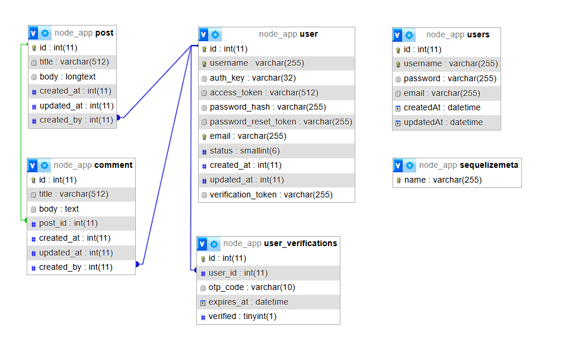
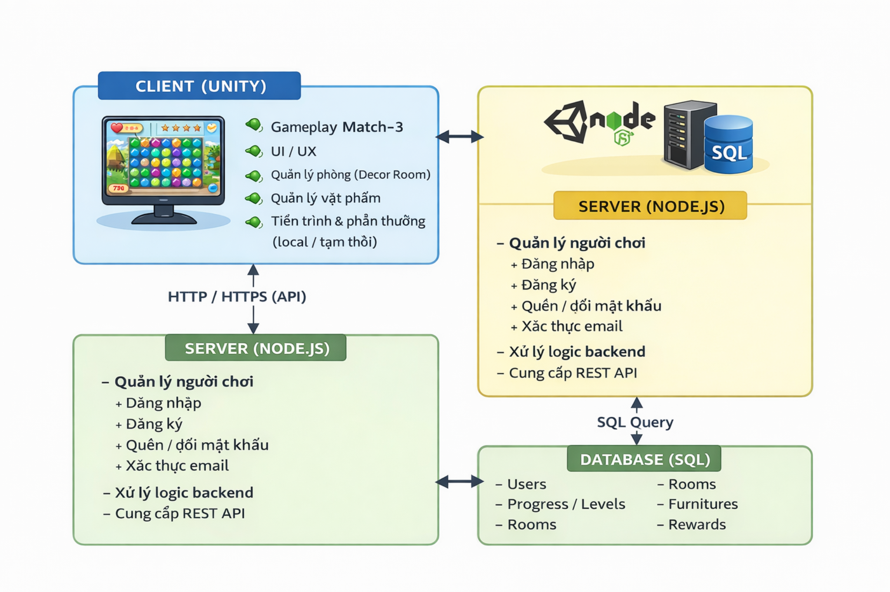

# SE2025-6.2
**GAME MATCH-3 KẾT HỢP TRANG TRÍ PHÒNG**

Phát triển game theo mô hình Client–Server, kết hợp Unity và Node.js

## 1. Introduction
Dự án Game Match-3 kết hợp Trang trí phòng là trò chơi thuộc thể loại Match-3, trong đó người chơi hoàn thành các màn chơi bằng cách ghép các khối cùng loại để đạt được mục tiêu đề ra. Sau mỗi màn chơi, người chơi sẽ nhận được phần thưởng (coin, sao) và sử dụng các tài nguyên này để mở khóa, trang trí và nâng cấp các căn phòng trong game.

Dự án không chỉ tập trung vào yếu tố giải trí mà còn chú trọng đến cách tổ chức mã nguồn, khả năng mở rộng và bảo trì hệ thống, qua đó mô phỏng quy trình phát triển một sản phẩm phần mềm thực tế.

## 2. Goals and Objectives

### 2.1 Goal

Phát triển một game Match-3 hoàn chỉnh, cho phép người chơi tương tác với gameplay, nhận phần thưởng và sử dụng phần thưởng để trang trí phòng, đồng thời đảm bảo hệ thống hoạt động ổn định và có khả năng mở rộng.

### 2.2 Objectives

- Thiết kế gameplay Match-3 với luật chơi rõ ràng và dễ tiếp cận

- Xây dựng hệ thống phần thưởng dựa trên kết quả màn chơi

- Phát triển giao diện người dùng trực quan, thân thiện

- Triển khai hệ thống trang trí phòng với cơ chế mở khóa và ẩn/hiện vật phẩm

- Xây dựng backend quản lý dữ liệu người chơi và tiến trình game

- Áp dụng mô hình kiến trúc client–server

- Đảm bảo tính ổn định, hiệu suất và khả năng bảo trì của hệ thống

## 3. Technologies
### 3.1 Game Client (Frontend)

- Unity Engine

- Ngôn ngữ C#

- Unity Scene & Prefab System

- Unity Animation System

### 3.2 Backend

- Node.js

- Express.js

- RESTful API

### 3.3 Database

Lưu trữ dữ liệu người chơi và trạng thái game (cấu hình trong backend) 

## 4. Video Demo Sản Phẩm

Link video demo: https://drive.google.com/drive/folders/1wcr1EGoRDb5Y19IYCypou3vLArPHR6_n?usp=sharing

Nội dung video demo:

- Giới thiệu tổng quan game

- Gameplay Match-3

- Nhận thưởng sau màn chơi

- Trang trí phòng và mở khóa vật phẩm

## 5. System Architecture

Hệ thống được xây dựng theo mô hình Client–Server, bao gồm:

Client (Unity):

- Xử lý gameplay Match-3

- Hiển thị giao diện người dùng

- Quản lý trạng thái phòng và vật phẩm

- Lưu trữ tiến trình và phần thưởng

Server (Node.js):

- Quản lý dữ liệu người chơi

- Cung cấp API cho client

## 6. Mô tả Use Case

### 6.1 Mô tả các Use Case chính

- Đăng nhập / Khởi tạo người chơi: Người chơi bắt đầu game và tạo dữ liệu ban đầu

- Chơi màn Match-3: Người chơi thực hiện ghép khối để hoàn thành mục tiêu

- Nhận thưởng: Hệ thống trao thưởng sau khi thắng màn chơi

- Trang trí phòng: Người chơi sử dụng tài nguyên để mở khóa và đặt vật phẩm

- Quản lý vật phẩm: Ẩn/hiện vật phẩm theo tiến trình

### 6.2 Use Case dự kiến phát triển

- Mở rộng nhiều phòng hơn

- Hệ thống sự kiện theo thời gian

- Hệ thống cửa hàng trong game

## 7. Project Structure
### 7.1 Unity Assets Structure
    Assets/
    ├── Art_HomeDesign/      # Sprite, phòng và nội thất
    ├── AnimationClip/       # Animation UI và object
    ├── Resources/           # Dữ liệu RoomsDB
    ├── Scenes/              # Các scene trong game
    ├── Scripts/             # Script C# điều khiển logic
    ├── Prefabs/             # Prefab UI và object

### 7.2 Backend Structure
    node-backend-api/
    ├── config/
    ├── controllers/
    ├── middlewares/
    ├── routes/
    ├── models/

### 8. Implementation Details

- Xử lý logic thắng/thua và tính điểm trong Unity

- Quản lý animation và hiệu ứng trực quan

- Điều khiển trạng thái vật phẩm dựa trên dữ liệu phòng

- Xây dựng RESTful API phục vụ game client

- Tổ chức mã nguồn theo hướng module hóa

## 9. Testing and Bug Classification
### 9.1 Testing

- Kiểm thử gameplay trực tiếp trên Unity Editor

- Kiểm tra các API backend bằng công cụ hỗ trợ

- Kiểm thử các trường hợp thắng/thua và trang trí phòng

## 10. Evaluation and Results
### 10.1 Evaluation

Dự án đã hoàn thành các mục tiêu đề ra ban đầu, các chức năng chính hoạt động ổn định và đúng theo thiết kế.

### 10.2 Results Achieved

- Hoàn thiện gameplay Match-3

- Triển khai hệ thống trang trí phòng

- Áp dụng mô hình client–server

- Củng cố kiến thức lập trình game và backend

## 11. Limitations and Future Work
### 11.1 Limitations

- Quy mô game còn hạn chế

- Chưa tối ưu sâu về hiệu năng

### 11.2 Future Work

- Mở rộng số lượng màn chơi và phòng

- Tối ưu trải nghiệm người dùng

- Bổ sung thêm các tính năng xã hội

## 12. Conclusion

Dự án là kết quả của quá trình vận dụng kiến thức học thuật vào thực tiễn phát triển game. Sản phẩm đạt được mục tiêu của học phần và tạo nền tảng cho việc phát triển các tính năng nâng cao trong tương lai.

